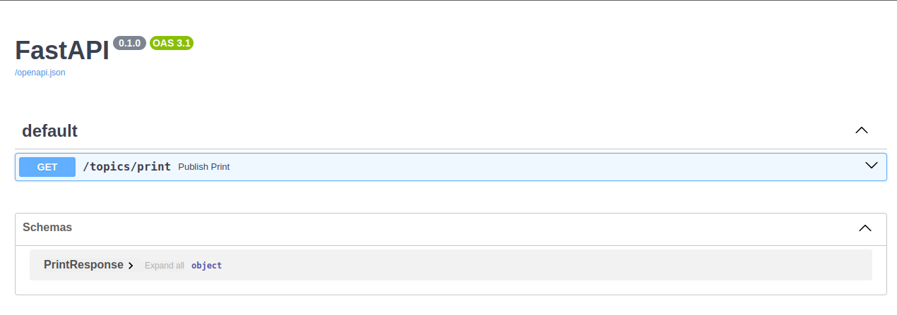

# A FastAPI-based API for ROS2 applications
The package assumes a [ROS2](https://docs.ros.org/en/iron/index.html) installation
that supports `pyproject.toml` files to specify the build system requirements
and [Poetry](https://python-poetry.org/). The package can be placed in the `src`
directory of a valid ROS2 workspace and built with
[colcon](https://colcon.readthedocs.io/en/released/index.html#) just like any
other package.

## Installation

The package can be installed with colcon using
[`colcon-poetry-ros`](https://github.com/UrbanMachine/colcon-poetry-ros) to provide
`Poetry` support to `colcon`, from the workspace folder:

```
colcon build --packages-select fastapi_ros2
```

Once the overlay has been sourced, the package can be used as a normal ROS2 package,
with the caveat that the scripts are not enabled for the `ros2 run` command.
They can however be run with Python directly from the workspace's `install` folder.

## Running the nodes

For the simple publisher node:
```
python3 install/fastapi_ros2/lib/fastapi_ros2/print_publisher
```

For the service nodes (in different terminals):
```
python3 install/fastapi_ros2/lib/fastapi_ros2/service
```

```
python3 install/fastapi_ros2/lib/fastapi_ros2/add_server
```

## Alternative: running the Python modules

```
poetry run python -m fastapi_ros2.examples.print_publisher
```

## Starting the API with support for a publisher node
The first endpoint of the API allows publishing to a topic `/print` a message of type `string`.

To start the app, run:

```
poetry run python -m fastapi_ros2.examples.print_publisher
```

Then go to **http://127.0.0.1:5001/docs#** and try the endpoint `/topics/print`.



In parallel, sniff the topic on a terminal with:

```
ros2 topic echo /print
```

The terminal should show the messages published to the topic:


