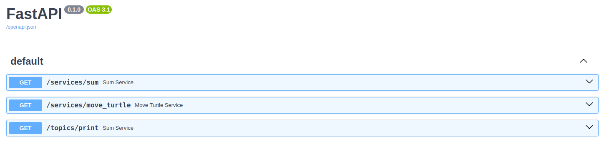
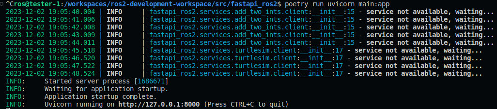
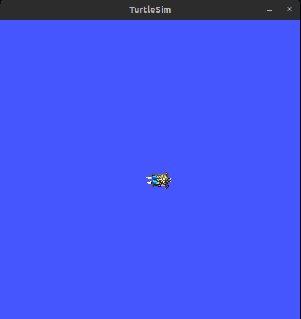
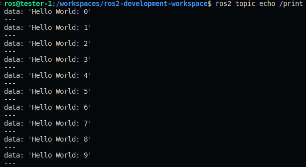

# A FastAPI-based API for ROS2 applications
The package assumes a [ROS2](https://docs.ros.org/en/iron/index.html) installation
that supports `pyproject.toml` files to specify the build system requirements
and [Poetry](https://python-poetry.org/). The package can be placed in the `src`
directory of a valid ROS2 workspace and built with
[colcon](https://colcon.readthedocs.io/en/released/index.html#) just like any
other package.

## Installation

The package can be installed with colcon using
[`colcon-poetry-ros`](https://github.com/UrbanMachine/colcon-poetry-ros) to provide
`Poetry` support to `colcon`, from the workspace folder:

```
colcon build --packages-select fastapi_ros2
```

Once the overlay has been sourced, the package can be used as a normal ROS2 package,
with the caveat that the scripts are not enabled for the `ros2 run` command.
They can however be run with Python directly from the workspace's `install` folder.

## Running the nodes

For the simple publisher node:
```
python3 install/fastapi_ros2/lib/fastapi_ros2/print_publisher
```

For the service nodes (in different terminals):
```
python3 install/fastapi_ros2/lib/fastapi_ros2/service
```

```
python3 install/fastapi_ros2/lib/fastapi_ros2/add_server
```

## Alternative: running the Python modules

```
poetry run python -m fastapi_ros2.examples.print_publisher
```

## Starting the API with `topics` and `services` routes
The current version of the API has the following endpoints available:



These allow:
- publishing to a topic `/print` a message of type `string`, using the `topics` route.
- place a request to the service `example_interfaces.srv.AddTwoInts` to sum up two integers and get the result back.
- place a request to the service `turtlesim.srv.TeleportAbsolute` to perform an absolute movement (position in cartesian x,y coordinates and angle in radians).

To start the app, run the following command from the package root directory:

```
poetry run uvicorn main:app
```



Then go to **http://127.0.0.1:8001/docs**

### Services

This version of the app includes two services endpoints: `GET /services/sum` and `GET /services/move_turtle`. The endpoints rely on asynchronous clients for each of the ROS2 services, which poll the status of the service during the spin up, and the API does not start until the services are available (as shown in the previous image).

The services live in the `services` module of the package, where any new service must be placed. When creating a new service, including both the `server` and `client` modules is recommended.

From the package location, start the `add_two_ints` service:
```
poetry run python3 /workspace_dir/install/fastapi_ros2/lib/fastapi_ros2/service
```

**NOTE:** This command can only be run after installing the packages in the ROS2 workspace, so that the scripts become available (`ros2 run` equivalent).

From the package location, start the `turtlesim` service:

```
ros2 run turtlesim turtlesim_node
```

This will spawn a new **turtlesim** window that is tied to the server that will receive the movement requests:



This window will show the movements of the turtle when the `GET /services/move_turtle` endpoint is used.

### Topics

When using the endpoint `GET /topics/print`, from a different terminal, sniff the `/print` topic with:

```
ros2 topic echo /print
```

The terminal should show the messages published to the topic:



The same will apply for any topic added to the API through the `topics` route.
